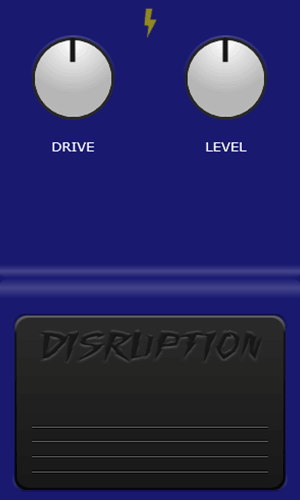

# Disruption Distortion Audio Plug-in

This is an audio plugin that provides distortion effects with a built-in tremolo and chorus. It's designed for musicians looking for custom sound shaping and tonal experimentation.



## How to use JUCE and your preferred IDE to build this project:

### 1. **Install JUCE**

Before you can open and build a `.jucer` file, you need to have JUCE installed on your machine.

#### For Windows:

- **Download**: Visit [JUCE's official site](https://juce.com/get-juce) and download the JUCE installer for Windows.
- **Install**: Run the installer and follow the instructions.

#### For macOS:

- **Download**: Visit [JUCE's official site](https://juce.com/get-juce) and download the macOS installer.
- **Install**: Open the `.dmg` file and drag JUCE into the Applications folder.

#### For Linux:

You can install JUCE using the following commands:

```bash
sudo apt-get install git cmake libasound2-dev libjack-jackd2-dev
git clone https://github.com/juce-framework/JUCE.git
```

### 2. **Clone GitHub Repository**

1. Open your terminal or command prompt.
2. Clone your GitHub repository to your local machine:
   
   ```bash
   git clone https://github.com/yourusername/disruption-distortion.git
   ```

3. Navigate to the project folder:

   ```bash
   cd disruption-distortion
   ```

### 3. **Open the `.jucer` File in Projucer**

JUCE includes a project management tool called **Projucer** that helps you manage your JUCE project, configure settings, and export it to your preferred IDE.

1. **Open Projucer**:
   - Navigate to where JUCE was installed and open the `Projucer` application.

2. **Open the `.jucer` File**:
   - In Projucer, go to `File > Open...` and select the `.jucer` file from your cloned repository.
   
3. **Configure the Project Settings**:
   - Once the project is open in Projucer, you can configure platform-specific settings such as the target platform, export settings, and more.
   - Navigate to the **Exporters** section to see the different platforms you can export the project for (e.g., Xcode, Visual Studio, Code::Blocks).

### 4. **Export the Project to Your IDE**

1. **Select Your Exporter**:
   - In Projucer, select the desired **exporter** from the left panel. For example, if you are on Windows, you might select **Visual Studio 2022**. On macOS, you could select **Xcode**.

2. **Export the Project**:
   - Click the **Save Project and Open in IDE** button located in the toolbar. This will generate the project files for your chosen IDE and open the project directly in it.

### 5. **Build the Project in Your IDE**

1. **Open the Project in Your IDE**:
   - If the IDE doesn’t open automatically after exporting, manually open the exported project file in your IDE (e.g., `.vcxproj` for Visual Studio, `.xcodeproj` for Xcode).

2. **Build the Project**:
   - In your IDE, locate the **Build** or **Run** option and compile the project. If everything is set up correctly, your plugin should compile without errors.

### 6. **Test the Plugin**

After building, you should have an audio plugin that can be used in a DAW (Digital Audio Workstation) that supports VST, AU, or AAX formats. The built files will be located in the **Build** folder within the project directory.

#### Additional Steps:
- **VST/AU Setup**: Some platforms may require additional SDKs (like the VST3 SDK) for exporting to VST or AU formats. You may need to configure paths to these SDKs in Projucer under the exporter settings.

## Features
- Drive knob for controlling distortion intensity.
- Level knob for managing output gain.
- Built-in tremolo and chorus effects with tempo control.

## Usage
- Adjust the `Drive` knob for distortion level.
- Use the `Level` knob for output gain control.
- Press the "Disruption" button to enable or disable the `Tremolo` and `Chorus` effects for modulation.
- Adjust the Disruption knob for tremolo tempo.

## Contributing
Contributions are welcome! Please open an issue or submit a pull request for any features or bug fixes.

## License
This project is licensed under the MIT License.

## Credits
This project was made using the [JUCE framework](https://juce.com/), and inspiration was drawn from various open-source JUCE projects and plugins.

## Acknowledgements
- [JUCE Framework](https://juce.com/) for the audio plugin foundation.
- [Alexei Radashkovsky](https://github.com/alexeiradashkovsky/mxrdistortionplus) for inspiration on the distortion/clipping algorithm, licensed under the MIT License.
- [Nicole Lassandro](https://github.com/HackAudio/juce-pedal-demo) for inspiration on the GUI, licensed under the MIT License.


